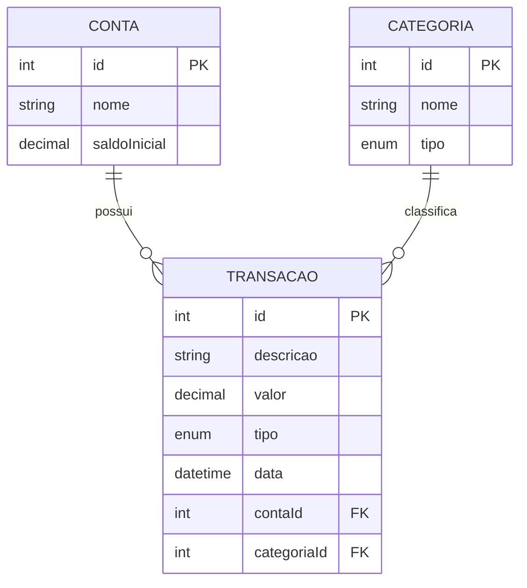

# DER

```mermaid
erDiagram
 CONTA ||--o{ TRANSACAO : possui
 CATEGORIA ||--o{ TRANSACAO : classifica
 CONTA { int id PK string nome decimal saldoInicial }
 CATEGORIA { int id PK string nome enum tipo }
 TRANSACAO { int id PK string descricao decimal valor enum tipo datetime data int contaId FK int categoriaId FK }
```
